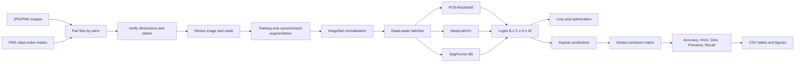

# Project Explanation and Oral Defense Guide

## How to use this document

This guide explains the current project code, not a generic segmentation example. Read it in this order:

1. Learn the two-minute summary.
2. Follow the pipeline diagram.
3. Read the notebook block map while looking at the notebook.
4. Study the function reference and worked examples.
5. Practise the oral questions without looking at the answers.

Notebook block numbers below mean the zero-based position in the notebook file. They are not the changing `In [x]` numbers shown by Jupyter.

## Two-minute oral summary

This project compares three semantic segmentation architectures on CamVid and SENSATION. FCN-ResNet50 and DeepLabV3+ are convolutional neural network models, while SegFormer-B0 uses a transformer-based MiT-B0 encoder. Semantic segmentation predicts one class for every image pixel.

The comparison is controlled within each dataset. All three models receive the same train, validation, and test split, image resolution, normalization, training augmentation, optimizer configuration, epoch budget, checkpoint rule, and evaluation implementation. CamVid uses 12 mask IDs, with the `Unlabelled` class ignored during metric calculation. SENSATION uses the official 10-class mapping and a weighted Cross Entropy plus Dice loss because its class-frequency analysis shows severe imbalance.

The models are initialized with ImageNet-pretrained encoders. During training, automatic mixed precision reduces GPU memory and computation time. Validation mIoU controls learning-rate reduction, checkpoint selection, and early stopping. The test set is used only after training and checkpoint selection.

Performance is measured with Pixel Accuracy, Mean IoU, Dice Score, macro Precision, macro Recall, per-class IoU, and inference time per image. A global confusion matrix is accumulated over the complete dataset before metrics are calculated. This avoids averaging batch metrics incorrectly. Predictions, curves, tables, and charts are stored in dataset-specific report folders.

## Complete pipeline



## Important tensor shapes

For batch size `B`, class count `C`, and square image size `H = W = IMAGE_SIZE`:

| Data | Shape | Type |
|---|---|---|
| One RGB image | `[3, H, W]` | `float32` |
| One mask | `[H, W]` | `int64` |
| Image batch | `[B, 3, H, W]` | `float32` |
| Mask batch | `[B, H, W]` | `int64` |
| Model logits | `[B, C, H, W]` | floating point |
| Predicted mask | `[B, H, W]` | `int64` after `argmax` |
| Confusion matrix | `[C, C]` | `int64` counts |

The model returns logits, not class IDs and not probabilities. Cross Entropy expects logits directly. `argmax(dim=1)` selects the class with the largest logit for each pixel.

## Project folders

```text
fcn-deeplabv3/
|-- fcn-deeplabv3-segmentation.ipynb
|-- segmentation_data.py
|-- PROJECT_EXPLANATION.md
|-- data/
|   |-- camvid/images/{train,val,test}
|   |-- camvid/masks/{train,val,test}
|   |-- sensation/images/{train,val,test}
|   `-- sensation/masks/{train,val,test}
|-- checkpoints/
|   |-- camvid/
|   `-- sensation/
`-- reports/
    |-- camvid/
    `-- sensation/
```

Checkpoints contain learned model parameters and checkpoint metadata. Reports contain CSV histories, metric tables, curves, qualitative predictions, and comparison charts.

# Notebook Block-by-Block Explanation

## Blocks 0-3: project definition and environment

### Block 0: title and abstract

Defines the research problem: compare two CNN architectures and one transformer architecture for urban semantic segmentation. The abstract states the datasets, fairness protocol, required metrics, and intended analysis.

### Block 1: Imports heading

Separates the academic introduction from executable setup.

### Block 2: imports, reproducibility, device, and folders

Imports file handling, numerical, plotting, OpenCV, PyTorch, and torchvision tools. It imports `SegmentationDataset` and `create_training_augmentation` from `segmentation_data.py`.

The random seed is applied to Python, NumPy, CPU PyTorch, and CUDA PyTorch. A seed makes repeated runs more reproducible, although GPU operations can still have nondeterministic behavior depending on the operation and environment.

`DEVICE` chooses CUDA when available:

```python
DEVICE = torch.device("cuda" if torch.cuda.is_available() else "cpu")
```

The directory constants route CamVid and SENSATION artifacts separately. Creating directories at startup prevents later save operations from failing because a folder is missing.

### Block 3: Dataset Configuration heading

Introduces dataset paths, classes, hyperparameters, and class-frequency settings.

## Blocks 4-8: dataset configuration and verification

### Block 4: CamVid and SENSATION configuration

Defines image and mask folders for each split. CamVid has 12 IDs; ID 11 is `Unlabelled` and is ignored in metrics. SENSATION uses 10 official IDs from `class_colors.csv`.

The main training values are:

```python
IMAGE_SIZE = 384
BATCH_SIZE = 2
NUM_WORKERS = 0
USE_AMP = True
EARLY_STOPPING_PATIENCE = 5
EARLY_STOPPING_MIN_DELTA = 1e-4
```

SENSATION pixel counts are measured from training masks only. Frequency for class `c` is:

```text
frequency[c] = class_pixel_count[c] / total_training_pixels
```

The logarithmic weight is:

```text
weight[c] = 1 / log(1.02 + frequency[c])
```

Weights are divided by their mean. Rare classes therefore receive larger loss contributions without the extremely large values produced by direct inverse frequency.

### Block 5: file discovery and dataset inspection helpers

Defines supported extensions, safe file listing, indexing by filename stem, split verification, and mask-value inspection. Pairing by stem allows `sample.jpg` to match `sample.png`.

Example:

```text
images/train/frame_001.jpg
masks/train/frame_001.png
```

Both have stem `frame_001`, so they form one sample.

### Block 6: verify both datasets

Runs structural checks for CamVid and SENSATION. It reports image counts, mask counts, matched pairs, missing masks, missing images, and observed mask IDs. This catches dataset errors before expensive training.

### Block 7: visual verification heading

Introduces visual inspection of image-mask alignment.

### Block 8: `DATASET_CONFIGS`

Creates one dictionary interface for both datasets. Training and evaluation functions use a `dataset_key` instead of containing duplicated CamVid and SENSATION code.

Each configuration stores name, paths, classes, class count, ignore index, class weights, palette, checkpoint folder, and report folder.

## Blocks 9-14: image and mask visualization

### Block 9: image, mask, color, and overlay functions

Loads RGB images and class-index masks. OpenCV reads color images as BGR, so the image is converted to RGB before Matplotlib displays it. Color masks map each integer class ID to its official RGB color. The overlay blends the original image and colored mask.

### Block 10: `visualize_dataset_sample`

Selects a sample, verifies the pair and dimensions, prints metadata, and displays input image, raw index mask, colorized mask, and overlay. This is a data-quality check, not a model prediction.

### Blocks 11-12: run visualization

Block 11 visualizes CamVid; block 12 visualizes SENSATION. Seeing plausible overlays confirms that masks are spatially aligned and class mapping is meaningful.

### Blocks 13-14: Dataset/DataLoader introduction

Explain that reusable loading, augmentation, normalization, and RAM caching live in `segmentation_data.py`.

## Blocks 15-18: DataLoaders and batch smoke tests

### Block 15: `create_dataloaders`

Creates train, validation, and test datasets and DataLoaders for a dataset key. Augmentation is passed only to the training split. Shuffling and `drop_last` are also training-only.

SENSATION training enables RAM caching:

```python
cache_in_memory=(dataset_key == "sensation" and split == "train")
```

`pin_memory=True` on CUDA allows faster host-to-GPU transfer. `NUM_WORKERS=0` is used because Windows/Jupyter multiprocessing workers previously failed and because a single-process RAM cache avoids separate worker copies.

### Block 16: create loaders

Creates `camvid_loaders` and `sensation_loaders`. Each dictionary has `train`, `val`, and `test` keys.

### Blocks 17-18: inspect one batch

Fetch one CamVid and one SENSATION training batch and print shape, dtype, and mask range. This is a smoke test for the complete data path.

Expected example with batch size 2 and image size 384:

```text
Image batch shape: [2, 3, 384, 384]
Mask batch shape:  [2, 384, 384]
Image dtype:       torch.float32
Mask dtype:        torch.int64
```

## Blocks 19-22: model definitions

### Block 19: architecture heading

Introduces the three architectures and the purpose of a CNN-transformer comparison.

### Block 20: model factory functions

Creates FCN-ResNet50, DeepLabV3+, and SegFormer-B0. All encoders use pretrained ImageNet weights. The final output layer is configured for the dataset class count.

### Block 21: parameter counting and model collection

`count_trainable_parameters` counts parameters that receive gradients. `build_models_for_dataset` creates all three models with the correct output classes, moves them to the device, and prints their trainable parameter counts.

### Block 22: instantiate CamVid models

Creates `camvid_models`. SENSATION models are created later with 10 output channels. Separate model instances are required because the classifier dimensions differ.

## Blocks 23-27: loss, optimizer, and metrics

### Block 23: section heading

Introduces optimization and formal evaluation.

### Block 24: loss and optimizer configuration

Defines learning rate, weight decay, compound loss, AdamW, and ReduceLROnPlateau. CamVid receives Cross Entropy because `class_weights=None`. SENSATION receives weighted Cross Entropy plus Dice loss.

### Block 25: confusion-matrix metrics

Accumulates a global class-by-class confusion matrix, then calculates Pixel Accuracy, per-class IoU, mean IoU, Dice, Precision, Recall, and per-class IoU. The matrix is currently used numerically; the notebook does not currently draw a confusion-matrix heatmap.

### Blocks 26-27: one-batch metric smoke tests

Run FCN on one CamVid and one SENSATION batch, convert logits to predictions, and verify that the metric functions return sensible values. These are implementation tests, not final test-set results.

## Blocks 28-35: training

### Block 28: training heading

Introduces the common training and validation protocol.

### Block 29: normalize model outputs

Torchvision FCN returns a dictionary containing `out`; SMP models return a tensor. `get_model_output` converts both APIs into one logits tensor.

### Block 30: train one epoch

Sets training mode, moves batches to the device, clears gradients, performs an AMP forward pass, computes loss, backpropagates through the gradient scaler, updates parameters, and returns mean batch loss.

### Block 31: validate a model

Sets evaluation mode, disables gradients, calculates validation loss, accumulates one global confusion matrix, and returns dataset-level metrics.

### Block 32: complete training controller

Creates loss, optimizer, scheduler, and AMP scaler. For each epoch it trains, validates, logs metrics, changes learning rate when mIoU plateaus, saves the best checkpoint, applies early stopping, and saves history to CSV.

### Blocks 33-35: CamVid training calls

Train FCN-ResNet50, DeepLabV3+, and SegFormer-B0 under the same `NUM_EPOCHS` value and DataLoaders. Histories are stored separately so one model cannot overwrite another model's results.

## Blocks 36-41: training analysis

### Block 36: curve heading

Introduces learning-curve analysis.

### Block 37: concatenate CamVid histories

Combines three DataFrames into one long table. The `model` column identifies each curve.

### Blocks 38-39: plot curves

Define and run a function that plots train loss, validation loss, validation mIoU, Pixel Accuracy, and Dice for every model. The figure is saved in `reports/camvid`.

### Blocks 40-41: best validation summary

For each model, select the row with maximum validation mIoU. This summary describes checkpoint selection without using the test set.

## Blocks 42-47: final CamVid evaluation

### Block 42: test evaluation heading

States the correct experimental rule: checkpoint selection happens on validation data, then the selected model is evaluated on test data.

### Block 43: load checkpoint

Loads saved weights and metadata, moves the model to the selected device, and sets evaluation mode.

### Block 44: inference timing

Synchronizes CUDA before and after timing because GPU operations are asynchronous. It returns seconds per image, not seconds per batch.

### Block 45: evaluate test set

Runs the formal metric pass and a separate inference-timing pass. This means the test DataLoader is traversed twice per model. It returns headline metrics and per-class IoU.

### Block 46: load best CamVid models

Loads all three validation-selected checkpoints from `checkpoints/camvid`.

### Block 47: evaluate and save CamVid tables

Evaluates each model, builds the headline and per-class tables, sorts by test mIoU, displays them, and saves CSV files in `reports/camvid`.

## Blocks 48-56: visual and quantitative CamVid comparison

### Block 48: qualitative heading

Explains why example predictions are needed in addition to aggregate numbers.

### Block 49: `predict_mask`

Adds a batch dimension to one image, runs inference, applies class-wise `argmax`, removes the batch dimension, and returns a NumPy index mask.

### Block 50: `denormalize_image`

Reverses ImageNet normalization so tensors can be displayed as normal RGB images.

### Blocks 51-52: qualitative grid

Define and generate a grid containing input, ground truth, FCN prediction, DeepLabV3+ prediction, and SegFormer prediction. The figure is saved in `reports/camvid`.

### Blocks 53-55: metric charts

Define and run six bar charts: Pixel Accuracy, mIoU, Dice, Precision, Recall, and inference time.

### Block 56: concise metric table

Displays only the metrics required in the final report.

## Blocks 57-71: SENSATION workflow

### Block 57: SENSATION section

Introduces the official 10-class SENSATION comparison. It uses the same three architectures, synchronized training augmentation, weighted Cross Entropy plus Dice, AMP, global metrics, and early stopping.

### Blocks 58-60: train SENSATION models

Train FCN, DeepLabV3+, and SegFormer with the SENSATION configuration. Checkpoints go to `checkpoints/sensation`; histories go to `reports/sensation`.

### Blocks 61-64: SENSATION validation analysis

Combine histories, plot curves, select each model's best validation epoch, and save the summary.

### Blocks 65-67: SENSATION test evaluation

Load the best validation checkpoints, evaluate all three models on the untouched test split, create headline and per-class tables, and save them in `reports/sensation`.

### Blocks 68-71: SENSATION visual and metric comparison

Generate the qualitative prediction grid, metric charts, and concise table using the same functions as CamVid.

## Blocks 72-76: cross-dataset interpretation

### Blocks 72-74: combined comparison

Concatenate CamVid and SENSATION test results and plot mIoU and Dice grouped by dataset and model. This tests whether architecture ranking is consistent across datasets.

### Block 75: discussion

Interprets accuracy, speed, class-level performance, architecture differences, and qualitative evidence. Exact conclusions must correspond to the latest regenerated results.

### Block 76: limitations and future work

Discusses single-seed uncertainty, fixed training budget, capacity mismatch, class imbalance, square resizing, boundary quality, and hardware-dependent timing.

# Function and Class Reference

## Functions in `segmentation_data.py`

### `list_supported_files(directory, extensions)`

**Purpose:** Return sorted files whose suffix is allowed.

**Inputs:** A `Path` and a set such as `{'.jpg', '.png'}`.

**Output:** `list[Path]`.

**Why sorting matters:** The same filesystem may return files in different orders. Sorting makes sample order reproducible.

```python
files = list_supported_files(Path("images/train"), {".jpg", ".png"})
```

### `index_files_by_stem(paths, file_kind)`

**Purpose:** Build `{stem: path}` and reject duplicate stems.

**Example:** `road_01.jpg` becomes key `road_01`. A simultaneous `road_01.png` in the same image folder would be ambiguous and raises an error.

### `load_image_rgb(image_path)`

Reads a three-channel image with OpenCV, checks that reading succeeded, and converts BGR to RGB.

### `load_mask_index(mask_path)`

Reads a mask without color conversion. It rejects a three-channel mask because training expects each pixel to contain one integer class ID.

Example mask:

```text
[[0, 0, 1],
 [0, 2, 2]]
```

This mask contains classes 0, 1, and 2. It is not an RGB picture.

### `create_training_augmentation()`

Returns one Albumentations `Compose` object containing:

- Horizontal flip, probability 0.5.
- Affine scale from 0.9 to 1.1, translation up to 5 percent, rotation from -5 to +5 degrees, probability 0.5.
- Brightness and contrast change, probability 0.4.
- Small hue, saturation, and value change, probability 0.2.

Albumentations receives image and mask together. Image geometry uses linear interpolation; mask geometry uses nearest-neighbor interpolation. Nearest neighbor is essential because interpolating IDs 1 and 2 must not invent values such as 1.4.

### `SegmentationDataset`

The class converts one image-mask pair into tensors suitable for training.

#### `__init__`

Stores paths and settings, lists supported files, pairs images and masks by stem, and raises an error when a mask is missing.

Important arguments:

| Argument | Meaning |
|---|---|
| `image_size` | Final square height and width |
| `num_classes` | Number of valid model output classes |
| `ignore_index` | Mask ID excluded from loss/metrics |
| `augmentation` | Training-only synchronized transform |
| `cache_in_memory` | Store resized samples in system RAM |

#### `__len__`

Returns the number of paired samples. DataLoader uses it to determine the number of batches.

#### `_validate_mask`

Compares observed mask values with valid class IDs and optional ignore index. A SENSATION mask containing ID 12 raises an error because valid IDs are 0 through 9.

#### `_load_and_resize`

Loads the pair, checks equal original dimensions, resizes image and mask, validates mask IDs, and uses an efficient small integer dtype when possible.

#### `__getitem__`

This is called by `dataset[index]` and by DataLoader.

Order of operations:

1. Read a cached resized pair or load it from disk.
2. Copy cached arrays so augmentation cannot alter the cache.
3. Apply random augmentation when configured.
4. Divide image values by 255.
5. Apply ImageNet normalization.
6. Convert image to `[C,H,W] float32` and mask to `[H,W] int64`.

**Cache example:** The first request for index 10 reads JPG and PNG, resizes them, and stores the arrays. Later epochs obtain index 10 from RAM. Augmentation still changes because only the pre-augmentation arrays are cached.

## Notebook data functions

### `verify_segmentation_structure(...)`

Checks every split, counts images and masks, and reports missing pairs. It does not modify files.

### `inspect_dataset_mask_values(...)`

Collects all unique IDs across masks. This verifies that `num_classes` and class mapping agree with actual annotation values.

### `colorize_mask(mask, palette)`

Creates an RGB array and assigns a color to every location where `mask == class_id`.

### `overlay_mask_on_image(image, color_mask, alpha=0.45)`

Blends image and mask. With `alpha=0.45`, 45 percent of the visible result comes from the mask and 55 percent from the image.

### `visualize_dataset_sample(...)`

Combines discovery, loading, validation, colorization, and plotting into one inspection function.

### `create_dataloaders(...)`

Returns:

```python
{
    "train": train_loader,
    "val": validation_loader,
    "test": test_loader,
}
```

`shuffle=True` prevents the optimizer from seeing samples in the same order every epoch. `drop_last=True` avoids a final training batch of size one, which can break Batch Normalization in DeepLabV3+. Validation and test do not shuffle or drop samples.

## Model functions and architecture theory

### `create_fcn_resnet50(num_classes, pretrained=True)`

Loads torchvision FCN with a ResNet50 backbone. It replaces the final 1x1 convolutions because ImageNet/COCO pretrained heads do not have the project's class count.

**FCN idea:** Replace classification's single image label with dense convolutional output. Deep features provide semantic understanding; upsampling maps them back to image resolution. FCN is simple and strong, but coarse deep features can blur small boundaries.

### `create_deeplabv3plus(...)`

Creates true DeepLabV3+ from `segmentation_models_pytorch` with a ResNet50 encoder.

**DeepLabV3+ idea:** Atrous Spatial Pyramid Pooling observes several effective receptive-field scales without aggressively reducing resolution. Its decoder combines high-level context with lower-level spatial features, which should help boundaries and objects at different sizes.

### `create_segformer_b0(...)`

Creates SegFormer using the MiT-B0 encoder.

**SegFormer idea:** A hierarchical transformer produces multi-scale features. Self-attention can model long-range relationships. SegFormer uses an efficient lightweight decoder and avoids positional encodings that are tied to one resolution.

**Important fairness limitation:** ResNet50 and MiT-B0 do not have equal parameter count or capacity. The project compares practical full architectures, not a perfectly capacity-matched test of convolution versus attention.

### `count_trainable_parameters(model)`

Sums `numel()` only for parameters with `requires_grad=True`. Frozen parameters would not be counted.

### `build_models_for_dataset(dataset_key)`

Uses the dataset's class count, constructs all models, moves them to `DEVICE`, prints parameter counts, and returns a name-to-model dictionary.

## Loss and optimization functions

### `WeightedCrossEntropyDiceLoss`

Cross Entropy evaluates class choice at each pixel. Dice evaluates overlap between predicted and target regions. The combined loss is:

```text
total_loss = 0.5 * weighted_cross_entropy + 0.5 * dice_loss
```

**Why combine them?** Cross Entropy gives stable pixel-level supervision. Dice directly rewards region overlap and is useful when class sizes differ greatly.

**Why not apply softmax first?** `nn.CrossEntropyLoss` and SMP Dice with `from_logits=True` perform the required stable conversion internally. Applying softmax manually would be redundant and can reduce numerical stability.

### `create_loss_function(ignore_index, class_weights)`

Factory behavior:

| Situation | Returned loss |
|---|---|
| No weights, no ignored ID | Cross Entropy |
| No weights, ignored ID | Cross Entropy with ignore index |
| Class weights provided | Weighted Cross Entropy plus Dice |

### `create_optimizer(model)`

Returns AdamW with learning rate `1e-4` and weight decay `1e-4`. AdamW adapts the step for each parameter and decouples weight decay from the gradient update.

### `create_scheduler(optimizer)`

Returns `ReduceLROnPlateau(mode="max")`. If validation mIoU does not improve for three epochs, learning rate is multiplied by 0.5. `mode="max"` is used because higher mIoU is better.

## Confusion matrix and metric functions

### `update_confusion_matrix(...)`

Rows are ground-truth classes and columns are predicted classes. A diagonal entry is correct. Off-diagonal entries are confusions.

The expression:

```python
encoded = target * num_classes + prediction
```

maps every `(target, prediction)` pair to one integer. `torch.bincount` counts all pairs without a slow Python pixel loop.

### Worked confusion-matrix example

For two classes:

```text
                 Predicted 0   Predicted 1
Ground truth 0       50             10
Ground truth 1        5             35
```

For class 1:

```text
TP = 35
FP = 10
FN = 5
IoU = TP / (TP + FP + FN) = 35 / 50 = 0.70
Dice = 2TP / (2TP + FP + FN) = 70 / 85 = 0.8235
Precision = TP / (TP + FP) = 35 / 45 = 0.7778
Recall = TP / (TP + FN) = 35 / 40 = 0.8750
```

Pixel Accuracy is `(50 + 35) / 100 = 0.85`.

### `compute_metrics_from_confusion_matrix(...)`

Defines:

```text
TP[c] = matrix[c,c]
FP[c] = predicted pixels of c - TP[c]
FN[c] = target pixels of c - TP[c]
Union[c] = TP[c] + FP[c] + FN[c]
```

It averages class metrics only across classes present in the target and excludes the ignore index. This is macro averaging: each valid class contributes equally, regardless of pixel count.

### `compute_segmentation_metrics(...)`

Convenience wrapper for a single batch. It creates a matrix, updates it once, and calculates metrics. Final validation/test evaluation instead accumulates one matrix over all batches.

**Why global accumulation is better:** Averaging batch mIoU gives equal importance to a small final batch and a full batch and can vary with batch composition. A global matrix calculates the metric from all pixels together.

## Training functions

### `get_model_output(model, images)`

Unifies two library APIs:

```text
torchvision FCN -> {"out": logits, "aux": ...}
SMP models      -> logits
```

The rest of the project can therefore treat every model identically.

### `train_one_epoch(...)`

`model.train()` activates training behavior such as Batch Normalization updates. `optimizer.zero_grad(set_to_none=True)` removes old gradients efficiently. The forward pass is wrapped in autocast. GradScaler scales loss before backward propagation to protect small float16 gradients from underflow.

One optimization cycle is:

```text
batch -> forward -> loss -> backward -> optimizer step
```

### `evaluate_model(...)`

`model.eval()` freezes training-specific behavior. `torch.no_grad()` prevents creation of a backward graph, reducing memory and time. No optimizer step occurs. Loss is weighted by batch size before averaging, and metrics come from one complete confusion matrix.

### `train_model(...)`

Coordinates the full run. A checkpoint is saved only when:

```text
new_val_mIoU > best_val_mIoU + minimum_delta
```

Early stopping triggers after five consecutive non-improving epochs. The best checkpoint can come from an earlier epoch than the final epoch.

Checkpoint contents include state dictionary, model name, dataset key, epoch, best validation mIoU, class names, and AMP setting. This metadata makes the artifact easier to audit.

## Analysis and evaluation functions

### `plot_training_curves(history_df, dataset_key)`

Plots optimization behavior. A falling training loss with rising validation loss can indicate overfitting. Validation mIoU is more important than loss for checkpoint selection because it directly measures segmentation overlap.

### `summarize_best_validation_results(history_df)`

Uses `idxmax()` on validation mIoU separately for every model. It must not use test mIoU for checkpoint selection because that would leak test information into model development.

### `load_best_checkpoint(...)`

Checks existence, loads weights on the requested device, restores parameters, and switches to evaluation mode.

### `measure_batch_inference_time(...)`

CUDA calls are asynchronous: Python can continue before the GPU finishes. Synchronizing before and after the timed forward pass makes elapsed wall-clock time meaningful.

### `evaluate_on_test_set(...)`

First calculates test loss and metrics. Then makes a second DataLoader pass for timing. Therefore a quiet cell can appear stuck while it performs six full test passes for three models.

### `predict_mask(...)`

Runs one normalized image through one model and returns class IDs. `unsqueeze(0)` changes `[3,H,W]` into `[1,3,H,W]`.

### `denormalize_image(...)`

Reverses:

```text
normalized = (image - mean) / std
```

using:

```text
image = normalized * std + mean
```

### `visualize_model_predictions(...)`

Uses identical samples for all models, which makes visual comparison fair. It displays class colors rather than raw logits.

### `plot_test_metric_comparison(...)`

Creates six model bar charts. Inference time is not restricted to 0-1 because it is measured in seconds; score metrics are restricted to that range.

### `plot_cross_dataset_comparison(...)`

Pivots the long results table into dataset rows and model columns, then compares mIoU and Dice across both datasets.

# Key Concepts for the Oral Defense

## ImageNet pretraining and normalization

ImageNet is a large image-classification dataset. Pretrained encoders have already learned useful edges, textures, shapes, and object patterns. Transfer learning adapts those features to segmentation with less data and training time.

The normalization constants are ImageNet channel statistics:

```python
mean = [0.485, 0.456, 0.406]
std  = [0.229, 0.224, 0.225]
```

Example for a normalized red value of an image pixel `R=0.8`:

```text
(0.8 - 0.485) / 0.229 = 1.376
```

## Batch size

Batch size is the number of samples processed before one optimizer update. A larger batch can improve GPU utilization but consumes more VRAM. Batch size one caused a Batch Normalization error in DeepLabV3+ when a deep feature map became `1 x 1`; using `drop_last=True` avoids a final one-sample training batch.

## DataLoader workers

Workers are CPU processes that prepare batches. More workers can reduce GPU waiting, but Windows/Jupyter process spawning failed in this environment. `num_workers=0` performs loading in the notebook process. SENSATION RAM caching reduces repeated JPG decoding and resizing after the first access.

## Augmentation versus preprocessing

Preprocessing is deterministic and required by the model, such as resizing and normalization. Augmentation is random training-only variation intended to improve generalization. Applying random augmentation to validation or test data would make evaluation inconsistent.

## Validation versus test

- Training data updates weights.
- Validation data selects checkpoints, learning rate, and stopping time.
- Test data estimates final generalization after decisions are complete.

Using the test set to choose epochs or hyperparameters is data leakage.

## Why mIoU is the primary metric

Pixel Accuracy can be high when a model predicts dominant background classes well but ignores rare objects. mIoU calculates overlap per class and then gives classes equal weight. It is therefore more informative for imbalanced semantic segmentation.

## Why a transformer may not win

Transformer performance depends on model capacity, data volume, augmentation, pretraining, and optimization. MiT-B0 is intentionally lightweight and is not capacity-matched to ResNet50. A fixed 25-epoch schedule can favor one architecture. The correct conclusion is not "transformers are worse"; it is "SegFormer-B0 did not outperform the CNN models under this protocol."

# Common Errors and What They Mean

## `Expected more than 1 value per channel`

This is a Batch Normalization training error caused by a batch of one combined with a `1 x 1` feature map. The project prevents it with training `drop_last=True` and batch size 2.

## DataLoader worker exited or hangs at `next(iter(loader))`

Windows/Jupyter multiprocessing could not start DataLoader workers reliably. Use `num_workers=0`. The hang occurs at `iter(loader)` because that is when workers actually start.

## `Checkpoint not found`

Training has not created the file, or the notebook points to the wrong dataset folder. Current folders are `checkpoints/camvid` and `checkpoints/sensation`.

## Classifier size mismatch while loading

A checkpoint with a different class count is being loaded. A 12-output checkpoint cannot be loaded into the official 10-class SENSATION model.

## Invalid mask values

The annotation contains an ID outside the configured classes. Do not silently remap it; check the official label mapping.

## Low GPU utilization

The GPU may wait for JPG decoding, resizing, augmentation, or transfer. RAM caching helps SENSATION after first access. A larger batch may help if VRAM permits, but it changes an experimental setting and must be documented.

## Test evaluation appears stuck

`evaluate_on_test_set` traverses the test set once for metrics and again for timing. Three models therefore require six passes, and the current function has no progress bar.

# Oral Defense Questions and Model Answers

## Project and methodology

### 1. What is semantic segmentation?

It assigns a semantic class to every image pixel. It produces a dense spatial output rather than one label for the complete image.

### 2. What is the central research question?

Whether FCN-ResNet50, DeepLabV3+, and SegFormer-B0 show different accuracy, class-level, qualitative, and computational behavior on CamVid and SENSATION under a controlled protocol.

### 3. Why these three models?

FCN is a classical CNN baseline, DeepLabV3+ is a stronger multi-scale CNN, and SegFormer-B0 is a lightweight transformer-based alternative.

### 4. What makes the comparison fair?

Within each dataset, all models use the same splits, resolution, preprocessing, augmentation, batch size, epoch budget, optimizer settings, checkpoint criterion, and metrics.

### 5. Is this a perfectly controlled CNN-versus-transformer ablation?

No. ResNet50 and MiT-B0 differ in capacity and design. It compares complete practical architectures rather than isolating attention as the only variable.

### 6. Why use two datasets?

Two datasets test whether architecture behavior is stable across different scene distributions, class systems, and dataset sizes.

### 7. Why keep train, validation, and test separate?

Training updates parameters, validation guides model selection, and test estimates final generalization. Mixing them causes leakage.

### 8. Why use a fixed seed?

It improves reproducibility of shuffling and random operations. One seed does not measure experimental variance, so repeated seeds remain future work.

## Dataset handling

### 9. Why can images be JPG while masks are PNG?

JPG is acceptable for natural images and saves storage. Masks need lossless PNG because compression artifacts could change class IDs.

### 10. How are images matched to masks?

By filename stem: `frame_20.jpg` matches `frame_20.png`.

### 11. Why verify image and mask dimensions?

A mismatch means image pixels and target pixels do not refer to the same locations.

### 12. Why resize masks with nearest neighbor?

It copies existing IDs. Linear interpolation could invent invalid fractional class values.

### 13. What is a class-index mask?

A single-channel array where every pixel value is one semantic class ID.

### 14. What is an ignore index?

An annotation ID excluded from loss or metrics. CamVid ID 11 represents unlabelled pixels.

### 15. Why preserve the official SENSATION mapping?

Changing IDs or names would invalidate semantic interpretation and comparability with the dataset specification.

### 16. Why calculate class weights from training masks only?

Using validation or test masks to design training weights would leak evaluation information.

## Preprocessing and augmentation

### 17. What is ImageNet normalization?

It standardizes RGB channels using the statistics expected by ImageNet-pretrained encoders.

### 18. Why transform image and mask together?

Geometric transformations must preserve pixel correspondence. Flipping only the image would make its mask incorrect.

### 19. Is augmentation used for validation or test?

No. Random evaluation transforms would make the benchmark inconsistent.

### 20. What is RAM caching?

It stores decoded and resized samples in system memory. Later epochs avoid repeated disk reading and resizing, while augmentation remains random afterward.

### 21. Why cache only SENSATION training?

SENSATION is larger and caused a CPU-loading bottleneck. CamVid is small, and evaluation splits are accessed fewer times.

### 22. Why use `num_workers=0`?

Windows/Jupyter multiprocessing failed in this environment. Zero workers is reliable and keeps one in-process RAM cache.

## Models

### 23. How does FCN perform segmentation?

It replaces image-level classification behavior with convolutional spatial prediction and upsamples dense class logits.

### 24. What is special about DeepLabV3+?

Atrous Spatial Pyramid Pooling captures multi-scale context, and its decoder combines semantic features with lower-level spatial detail.

### 25. What is special about SegFormer?

Its hierarchical MiT transformer learns multi-scale and long-range features while using a lightweight decoder.

### 26. Why replace FCN's classifier layer?

The pretrained head predicts a different class set. The final convolution must output the project's class count.

### 27. Why use pretrained encoders?

They provide general visual features learned from a large dataset, improving convergence when segmentation data and time are limited.

### 28. Why might SegFormer-B0 not win?

It is a small transformer, may have lower capacity, and may require more data or a different schedule. Transformer architecture alone does not guarantee better results.

## Loss and optimization

### 29. What does Cross Entropy optimize?

It penalizes incorrect class logits at every valid pixel.

### 30. Why add Dice loss for SENSATION?

Dice directly rewards region overlap and complements weighted pixel-level Cross Entropy under class imbalance.

### 31. What does class weighting do?

It increases the gradient influence of errors on rare classes.

### 32. Why logarithmic rather than direct inverse-frequency weights?

Direct inverse frequency can create extreme unstable weights; the logarithm moderates their range.

### 33. Why AdamW?

It provides adaptive updates and decoupled weight decay and works reliably for both CNN and transformer training.

### 34. What does the scheduler monitor?

Validation mIoU. When it plateaus, learning rate is halved.

### 35. What is early stopping?

Training stops after five consecutive epochs without meaningful validation mIoU improvement.

### 36. Why save the best checkpoint instead of the last epoch?

The last epoch may overfit or degrade. The best validation mIoU represents the strongest observed generalizing state.

### 37. What is AMP?

Automatic mixed precision uses lower precision where safe to reduce GPU memory and often accelerate computation.

### 38. Why use GradScaler?

It protects small float16 gradients from numerical underflow during backward propagation.

## Metrics

### 39. Why not report only Pixel Accuracy?

Dominant classes can make accuracy high even if small classes fail. mIoU and per-class IoU expose this.

### 40. Define IoU.

`IoU = TP / (TP + FP + FN)`.

### 41. Define Dice Score.

`Dice = 2TP / (2TP + FP + FN)`.

### 42. Define Precision and Recall.

Precision is `TP / (TP + FP)`; Recall is `TP / (TP + FN)`.

### 43. What does high recall but lower precision mean?

The model finds many true pixels but also predicts too many false-positive pixels.

### 44. How is the confusion matrix organized?

Rows are ground truth and columns are predictions. Diagonal entries are correct; off-diagonal entries are errors.

### 45. Is a confusion matrix a metric?

It is a count table rather than one scalar score. Accuracy, IoU, Precision, and Recall are derived from it.

### 46. Why use one global confusion matrix?

It avoids batch-composition bias and calculates metrics from all dataset pixels together.

### 47. What is macro averaging?

Calculate a metric per valid class, then average classes equally, regardless of class pixel count.

### 48. Why report per-class IoU?

It reveals difficult semantic categories and minority-class failures hidden by aggregate scores.

## Evaluation and interpretation

### 49. Why call `model.eval()`?

It switches Batch Normalization and similar layers to deterministic evaluation behavior.

### 50. Why use `torch.no_grad()`?

Evaluation does not need gradients, so disabling them saves memory and computation.

### 51. Why synchronize CUDA when timing?

GPU execution is asynchronous. Synchronization prevents stopping the timer before inference finishes.

### 52. Why divide batch time by batch size?

The required metric is inference time per image.

### 53. Why include qualitative predictions?

Metrics cannot show boundary shape, thin structures, spatial plausibility, or specific failure modes.

### 54. How should similar mIoU scores be compared?

Consider repeated-run uncertainty, per-class IoU, Precision/Recall, inference time, parameter count, and qualitative errors. A tiny single-run difference may not be meaningful.

### 55. What are the main limitations?

One seed, fixed budget, unequal model capacity, square resizing, severe imbalance, no boundary-specific metric, and hardware-dependent timing.

### 56. What would you improve next?

Use multiple seeds, preserve aspect ratio, train longer, compare capacity-matched backbones, add boundary metrics, and test targeted sampling or focal/Tversky losses.

# Suggested Oral Presentation Order

1. Pixel-wise urban scene understanding problem.
2. CNN-versus-lightweight-transformer research question.
3. Datasets and official labels.
4. Fair split, preprocessing, and augmentation protocol.
5. Three architecture ideas.
6. SENSATION imbalance and compound loss.
7. AdamW, AMP, scheduler, checkpointing, and early stopping.
8. Global confusion-matrix metrics.
9. Quantitative and qualitative results.
10. Limitations and defensible conclusion.

Do not claim that one architecture category is universally better. State that one implementation performed better under the project's specific data, capacity, and training conditions.

# One-Page Revision Sheet

## Core objective

Compare FCN-ResNet50, DeepLabV3+, and SegFormer-B0 on CamVid and official 10-class SENSATION using a controlled semantic-segmentation protocol.

## Data

- Inputs: JPG/PNG RGB images.
- Targets: lossless PNG class-index masks.
- Pairing: filename stem.
- Resize: linear for images, nearest neighbor for masks.
- Normalize: ImageNet statistics.
- Augment: training only, synchronized image and mask.
- Cache: SENSATION training only, before augmentation.

## Models

- FCN: simple dense CNN baseline with ResNet50.
- DeepLabV3+: ResNet50, atrous multi-scale context, decoder refinement.
- SegFormer-B0: hierarchical MiT transformer, lightweight decoder.

## Optimization

- AdamW, learning rate `1e-4`, weight decay `1e-4`.
- CamVid: Cross Entropy with unlabelled ignore index.
- SENSATION: 0.5 weighted Cross Entropy + 0.5 Dice.
- AMP and GradScaler on CUDA.
- Scheduler and checkpoints use validation mIoU.
- Early stopping after five non-improving epochs.

## Metrics

```text
Accuracy  = correct pixels / valid pixels
IoU       = TP / (TP + FP + FN)
Dice      = 2TP / (2TP + FP + FN)
Precision = TP / (TP + FP)
Recall    = TP / (TP + FN)
```

- mIoU is the primary segmentation metric.
- Per-class IoU exposes rare-class performance.
- Confusion matrix rows are targets; columns are predictions.
- Inference timing synchronizes CUDA.

## Defense-safe conclusions

- This compares practical complete architectures.
- It is not a capacity-matched attention ablation.
- Pixel Accuracy alone is insufficient under imbalance.
- Test data must not influence checkpoint selection.
- A transformer is not guaranteed to win with limited data and a fixed schedule.
- Small objects and boundaries require class-level and qualitative analysis.

## Final pre-defense checks

- Know both class counts and CamVid's ignore index.
- Explain nearest-neighbor mask resizing.
- Know tensor shapes before and after the model.
- Calculate IoU from TP, FP, and FN.
- Explain why validation mIoU selects checkpoints.
- Explain AMP, RAM cache, batch size, and workers in one sentence each.
- Read the latest regenerated CSV tables before quoting numbers.
